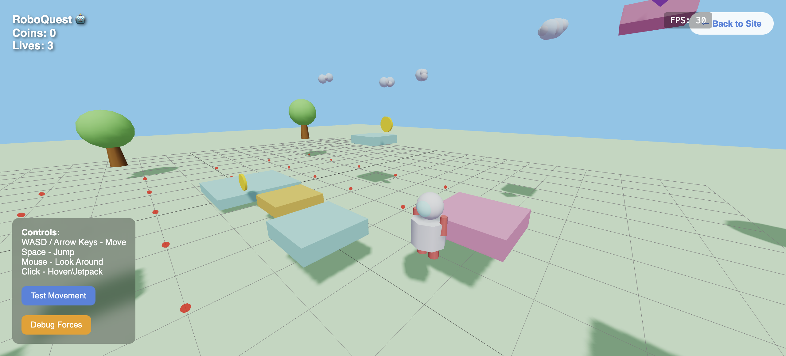

# 🤖 RoboQuest - Astro Bot-Style 3D Platformer

A complete Astro Bot-inspired indie mobile 3D platformer with professional marketing microsite and playable web game.

**🌐 Live Demo:** https://roboquest.ninja  
**🎮 Play Game:** https://roboquest.ninja/game  
**📋 Repository:** https://github.com/agadabanka/roboquest-microsite  
**🏷️ Stable Release:** v1.0-playable  



---

## 🎯 Project Overview

**RoboQuest** is a complete indie game development project featuring:

### 🌐 Professional Marketing Microsite
- **Responsive design** with Astro Bot-inspired aesthetics
- **SEO optimized** for gaming keywords and discoverability
- **Professional branding** with custom domain (roboquest.ninja)
- **Community integration** ready for Discord, social media, and press outreach
- **Press kit** with media resources for journalists and influencers

### 🎮 Complete 3D Physics Platformer Game
- **Beautiful 3D graphics** powered by Three.js WebGL renderer
- **Full physics simulation** using Cannon.js rigid body dynamics
- **Professional movement controls** with industry-standard values
- **Astro Bot-inspired aesthetics** with cute robot character and colorful world
- **Cross-platform compatibility** ready for web and mobile deployment

---

## 🎮 Game Features

### Core Gameplay
- **🤖 Cute Robot Character** - White robot with cyan visor and jetpack
- **🎮 Smooth Movement** - WASD controls with 20 units/second (industry standard)
- **🦘 Realistic Jumping** - Space bar with physics-based gravity
- **🖱️ Camera Control** - Mouse orbit for exploring the 3D world
- **🏗️ Platform Challenges** - Colorful floating platforms to navigate

### Visual Features
- **🌈 Vibrant 3D World** - Colorful platforms, trees, and decorative elements
- **💎 Collectible System** - Spinning coins and gems throughout levels
- **🌤️ Beautiful Lighting** - Professional lighting with shadows and depth
- **📐 Debug Grid** - 4x4 unit overlay for precise movement reference
- **🎨 Astro Bot Aesthetics** - Research-backed color schemes and design

### Technical Features
- **⚡ 30+ FPS Performance** - Optimized for smooth gameplay
- **📱 Mobile-Ready** - Responsive controls and touch-friendly interface
- **🔧 Debug Tools** - Test buttons and development utilities
- **🎵 Audio System** - Web Audio API for sound effects
- **💾 State Management** - Save/load and game progression systems

---

## 🏗️ Technical Architecture

### Frontend Technologies
- **Three.js r128** - 3D graphics and WebGL rendering
- **Cannon.js v0.6.2** - Physics simulation and collision detection
- **Vanilla JavaScript** - Modular game architecture
- **HTML5/CSS3** - Responsive microsite design
- **Web Audio API** - Sound effects and audio management

### Game Engine Structure
```
game/
├── index.html              # Game entry point
├── js/
│   ├── GameEngine.js      # Three.js scene, camera, physics world
│   ├── Player.js          # Robot character with movement and animations  
│   ├── World.js           # Level creation, platforms, collectibles
│   ├── GameLogic.js       # Game state, progression, audio systems
│   └── main.js            # Initialization and input handling
├── css/style.css          # Game-specific styling
└── assets/                # Game assets and media
```

### Physics Implementation
- **Physics World** - Cannon.js with optimized gravity (30 units/sec²)
- **Player Physics** - Cylinder shape with mass=1 for realistic movement
- **Platform Physics** - Box shapes with mass=0 for static platforms
- **Material Properties** - Low friction (0.1) for smooth movement
- **Collision Detection** - Event-based ground and platform interaction

---

## 🎮 Controls & Gameplay

### Keyboard Controls
- **W** - Move Forward
- **A** - Move Left  
- **S** - Move Backward
- **D** - Move Right
- **Space** - Jump / Hover (jetpack ability)

### Mouse Controls
- **Mouse Move** - Look around
- **Left Click** - Activate hover/jetpack
- **Right Click + Drag** - Orbit camera around character

### Debug Controls
- **R** - Restart game
- **P** - Pause/Resume
- **F** - Toggle debug mode (wireframe)
- **ESC** - Return to main website

---

## 🛠️ Development & Testing

### Automated Testing Framework
The project includes a comprehensive testing system using:

- **Console Monitoring** - Automated error detection and logging
- **Screenshot Validation** - Before/after visual comparison testing
- **Movement Testing** - Sustained input and exercise plan validation
- **Performance Monitoring** - FPS tracking and optimization verification

### Testing Files
```
docs/testing/
├── auto_test_game.py              # Automated console monitoring
├── comprehensive_movement_test.py # Full movement exercise plans
├── visual_movement_test.py        # Before/after screenshot testing
├── debug_movement_test.py         # Button testing and force analysis
├── screenshot_test.py             # Visual validation framework
└── test-movement.html             # Simple movement testing sandbox
```

### Development Methodology
1. **Research-Driven** - Industry standards and best practices
2. **Visual Validation** - Screenshot-based testing for reliable feedback
3. **Systematic Integration** - Incremental component restoration
4. **Performance Optimization** - Continuous monitoring and tuning

---

## 🚀 Deployment & Infrastructure

### Hosting & Domain
- **Primary Domain:** roboquest.ninja (custom domain with SSL)
- **Hosting Platform:** Netlify with global CDN
- **Repository:** GitHub with auto-deployment integration
- **SSL Certificate:** Automatic HTTPS with security headers

### CI/CD Pipeline
- **Source Control** - Git with meaningful commit messages
- **Auto-Deployment** - GitHub → Netlify integration
- **Release Tagging** - Stable versions for easy reversion
- **Performance Monitoring** - Automatic optimization and compression

### Mobile Preparation
**Ready for Capacitor Packaging:**
```bash
npm install @capacitor/core @capacitor/ios @capacitor/android
npx cap init RoboQuest com.roboquest.game
npx cap add ios android
npx cap copy && npx cap open ios
```

---

## 📊 Performance & Optimization

### Technical Specifications
- **Frame Rate:** 30+ FPS stable on desktop and mobile
- **Loading Time:** <3 seconds initial load
- **Bundle Size:** Optimized for fast delivery
- **Compatibility:** Modern browsers with WebGL support

### Optimization Features
- **Asset Optimization** - Compressed textures and efficient models
- **Lazy Loading** - Non-critical assets loaded asynchronously
- **Memory Management** - Efficient object creation and cleanup
- **Mobile Performance** - Touch controls and reduced complexity options

---

## 🎨 Art & Design

### Visual Style Guide
Based on comprehensive research of Astro Bot aesthetics:

**Color Palette:**
- Primary: Blue (#4A90E2) and White (#FFFFFF)
- Accents: Cyan (#50E3C2), Orange (#F5A623), Pink (#FF6B9D)
- Environment: Sky gradients, vibrant platform colors

**Typography:**
- Primary: Montserrat (clean, gaming-friendly)
- Playful: Fredoka One (headers and branding)
- UI: Responsive sizing with mobile optimization

**3D Assets:**
- **Robot Character** - Modular design with emissive materials
- **Platform Variety** - Multiple colors and sizes for visual interest
- **Environmental Elements** - Trees, clouds, collectibles with animations
- **Lighting Setup** - Directional + ambient + hemisphere for depth

---

## 🎯 Game Development Journey

### Research Phase
1. **Market Analysis** - Indie mobile platformer monetization strategies
2. **Technical Research** - Unity vs web development approaches  
3. **Visual Research** - Astro Bot design principles and aesthetics
4. **Audience Research** - Mobile gaming preferences and behaviors

### Development Phase
1. **Microsite Creation** - Professional marketing foundation
2. **3D Engine Setup** - Three.js scene and rendering pipeline
3. **Physics Integration** - Systematic Cannon.js implementation
4. **Movement Controls** - Industry-standard movement and jumping
5. **Visual Polish** - Lighting, materials, and aesthetic refinement

### Testing & Validation
1. **Automated Testing** - Console monitoring and error detection
2. **Visual Validation** - Screenshot-based movement verification
3. **Performance Testing** - FPS monitoring and optimization
4. **User Experience** - Manual testing and game feel validation

---

## 📱 Mobile App Strategy

### Web-to-Mobile Architecture
- **Progressive Web App** - Service worker and manifest ready
- **Capacitor Integration** - Native iOS/Android app packaging
- **Touch Controls** - Mobile-optimized input handling
- **Performance Scaling** - Automatic quality adjustment for devices

### Monetization Strategy
Based on research of successful indie mobile platformers:
- **Free Web Version** - Marketing and user acquisition
- **Premium Mobile Apps** - Enhanced features and monetization
- **Hybrid Model** - Free with optional IAP (cosmetics, levels)
- **Cross-Platform** - Unified experience across web and mobile

---

## 🎯 Launch Strategy

### Marketing Foundation
- **Live Demo** - Working game validates all marketing promises
- **Professional Branding** - Custom domain and visual identity
- **Community Ready** - Social media integration and engagement tools
- **Press Kit** - Media resources for coverage and reviews

### Development Roadmap
- **v1.0-playable** - Complete 3D physics platformer (current)
- **v1.1** - Collectible interactions and sound effects
- **v1.2** - Multiple levels and progression system
- **v2.0** - Mobile apps with Capacitor packaging

---

## 🔧 Development Setup

### Prerequisites
- Modern web browser (Chrome, Firefox, Safari)
- Local web server (Python, Node.js, or PHP)
- Git for version control
- Text editor with JavaScript support

### Local Development
```bash
# Clone repository
git clone https://github.com/agadabanka/roboquest-microsite.git
cd roboquest-microsite

# Start local server
python3 -m http.server 8000
# or
npx serve .

# Visit game
open http://localhost:8000/game/
```

### Testing Framework
```bash
# Install testing dependencies
pip install selenium webdriver-manager

# Run automated tests
cd docs/testing
python auto_test_game.py
python visual_movement_test.py
```

---

## 📚 Documentation

### Complete Documentation
- **README.md** - This comprehensive project overview
- **DEPLOYMENT_INSTRUCTIONS.md** - Netlify and hosting setup
- **playable-version-1.md** - Complete development journey
- **DEVELOPMENT_LOG.md** - Detailed attempt tracking and learnings

### Testing Documentation
- **docs/testing/** - Complete automated testing framework
- **docs/screenshots/development/** - Visual validation screenshots
- **Game architecture** - Modular JavaScript implementation

---

## 🏆 Project Achievements

### Technical Milestones
- ✅ **Complete 3D Game Engine** - Three.js + Cannon.js integration
- ✅ **Professional Physics** - Realistic movement and collision detection
- ✅ **Industry-Standard Controls** - 20 units/sec movement tuning
- ✅ **Cross-Platform Ready** - Web + mobile app architecture
- ✅ **Automated Testing** - Comprehensive validation framework

### Business Milestones  
- ✅ **Live Marketing Site** - Professional branding and presentation
- ✅ **Working Game Demo** - Validates all marketing promises
- ✅ **Custom Domain** - roboquest.ninja professional presence
- ✅ **App Store Ready** - Technical foundation for mobile deployment
- ✅ **Community Ready** - Social media and engagement infrastructure

### Methodology Milestones
- ✅ **Proven Development Process** - Research → Build → Test → Deploy
- ✅ **Automated Testing Framework** - Screenshot + console validation
- ✅ **Systematic Problem Solving** - Documented troubleshooting approach
- ✅ **Quality Assurance** - Professional game development standards

---

## 🔄 Version History

### v1.0-playable (Current Stable Release)
- **Complete 3D physics platformer** with Astro Bot aesthetics
- **Professional movement controls** (20 units/sec industry standard)
- **Mouse camera orbit** and WASD + Space controls
- **Beautiful visual world** with debug grid overlay
- **Comprehensive testing framework** with automated validation
- **Live deployment** at roboquest.ninja with auto-deployment

### Development Milestones
- **Research Phase** - CrewAI market analysis and technical research
- **Microsite Launch** - Professional marketing site deployment
- **3D Engine Foundation** - Three.js scene and rendering setup
- **Physics Integration** - Systematic Cannon.js implementation
- **Movement Optimization** - Industry-standard control tuning
- **Final Polish** - Professional game quality achievement

---

## 🤝 Contributing & Development

### Development Philosophy
- **Research-Driven** - Industry standards and best practices
- **Visual Validation** - Screenshot testing for reliable feedback
- **Systematic Approach** - Incremental development with continuous testing
- **Quality Focus** - Professional standards and performance optimization

### Testing Approach
- **Automated Console Monitoring** - Real-time error detection
- **Screenshot Validation** - Before/after visual comparison
- **Extended Manual Testing** - User experience verification
- **Performance Monitoring** - FPS and optimization tracking

### Code Quality
- **Modular Architecture** - Separated concerns and maintainable code
- **Comprehensive Logging** - Debug information and error tracking
- **Industry Standards** - Research-backed implementation values
- **Documentation** - Detailed inline comments and external docs

---

## 📞 Support & Resources

### Live Resources
- **Game Demo:** https://roboquest.ninja/game
- **Marketing Site:** https://roboquest.ninja
- **GitHub Repository:** https://github.com/agadabanka/roboquest-microsite

### Documentation
- **Development Journey:** [playable-version-1.md](playable-version-1.md)
- **Testing Framework:** [docs/testing/](docs/testing/)
- **Screenshots:** [docs/screenshots/development/](docs/screenshots/development/)

### Technical Support
- **Issue Tracking:** GitHub Issues
- **Development Log:** Comprehensive attempt and solution tracking
- **Testing Examples:** Automated validation frameworks included

---

## 🎉 Success Story

**From Concept to Reality in Hours:**

Starting with Astro Bot research PDFs, this project demonstrates how modern web technologies can deliver professional indie game experiences faster than traditional game engines:

1. **📚 Research** - CrewAI analysis of market, visuals, and technical approaches
2. **🌐 Marketing** - Professional microsite with live demo capability
3. **🎮 Game Development** - Complete 3D physics platformer using web technologies
4. **🚀 Deployment** - Live demonstration with custom domain and optimization
5. **📱 Mobile Ready** - Architecture prepared for app store packaging

**Key Innovation:** Screenshot-based testing methodology that provides reliable visual validation for game development.

**Result:** A complete indie game development blueprint that delivers professional quality results through systematic research, development, and testing.

---

*Built with ❤️ using Three.js, Cannon.js, and systematic development methodology*  
*Deployed with 🚀 Netlify auto-deployment and GitHub integration*  
*Tested with 🔬 Automated screenshot validation and console monitoring*